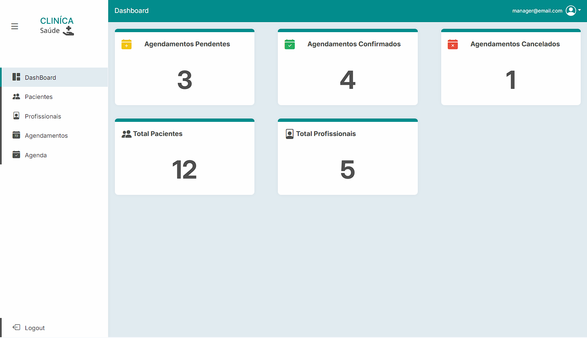
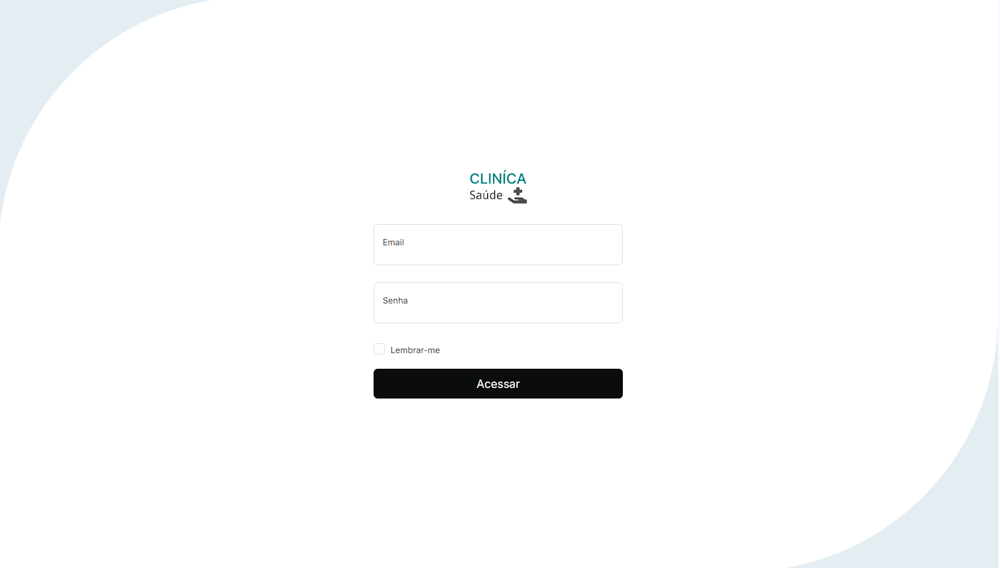

# Template React Clinica
Desenvolvimento do frontend do projeto de trabalho de conclusão de curso, gestão clínica.

# Tecnologias
- ReactJS
- Figma

# Bibliotecas
- Axios
```bat
yarn add axios@0.27.2
```

- QS
```bat
yarn add qs@6.11.0 @types/qs@6.9.7
```

- History
```bat
yarn add history@5.3.0
```

- jwt-decode
```bat
yarn add jwt-decode@3.1.2 @types/jwt-decode@3.1.0
```


# Protótipos
## Dash

## Login

## Formulário


## Visualizar


